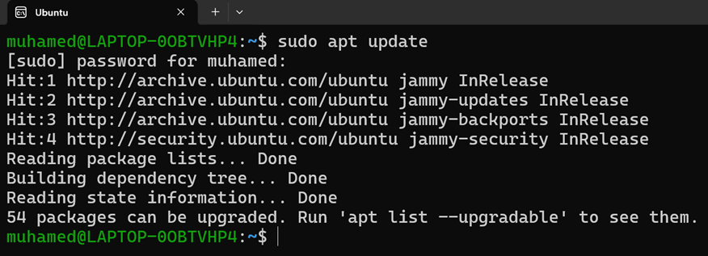
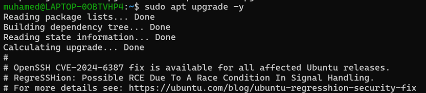
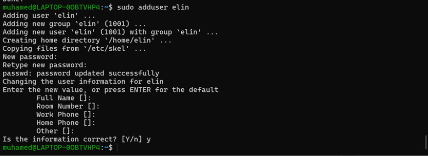
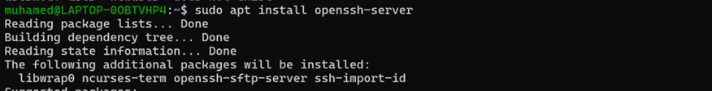
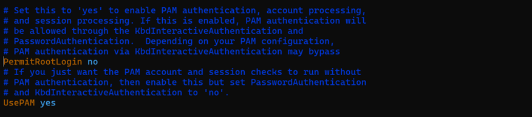
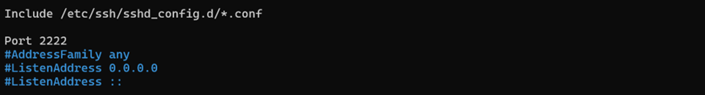
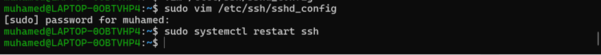

# Basic Linux Server Setup

This project will demonstrate our ability to set up and configure a Linux server from scratch, ensuring that it is properly configured and secure. Steps to Complete the Project:

## 1.	Initial Server Configuration

- Update the package index and upgrade installed packages: 

- Create a New User and Add to the Sudo Group giving it administrative
    privileges.

## 2.	Configuring SSH Access 

   - Install and configure OpenSSH Server:

   
     
   - Secure SSH by editing the configuration file (/etc/ssh/sshd_config):
        - Disable root login: PermitRootLogin no
        - Change the default SSH port: Port 2222

   
    
   
   
   - Restart SSH Service to Apply Changes

   
        

   

   

     

   

