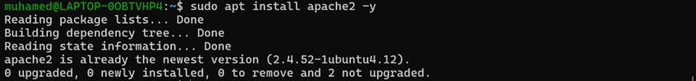
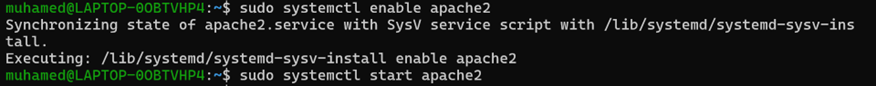
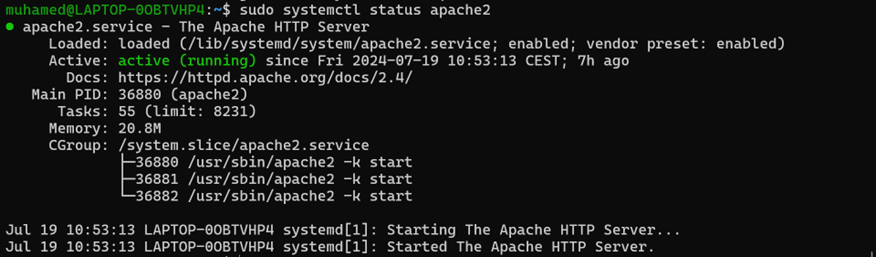
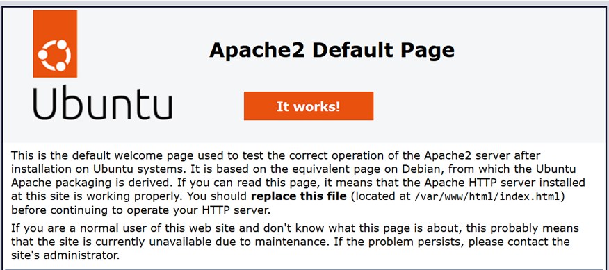

In this section, we will cover the installation and basic configuration of the Apache web server, which is one of the most widely used and robust web servers available for Linux systems. Apache provides a reliable and high-performance platform for serving web content, and configuring it properly is essential for deploying web applications and websites

Steps to be covered:

1.	Install Apache Web Server
o	The Apache web server, known for its flexibility and power, will be installed using the package manager. This step ensures that the necessary software is downloaded and installed on the server.
 

2.	Enable Apache Service

•	To ensure that the Apache web server starts automatically on system boot, we will enable the Apache service. This step configures the system to start Apache whenever the server is restarted, ensuring continuous availability of web services.

3.	Start Apache Service
   
•	After enabling the service, we will start Apache to begin serving web content immediately. This step activates the Apache service, making it ready to handle incoming web requests and deliver content to users.
 
 
 

 - Verifying by visiting the server's IP address

 

