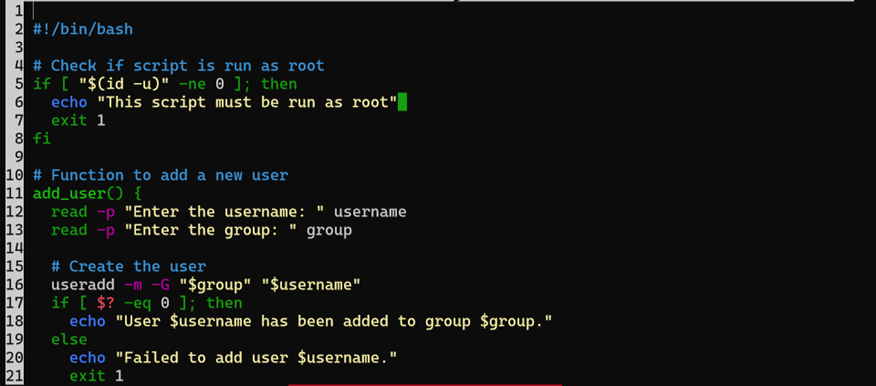
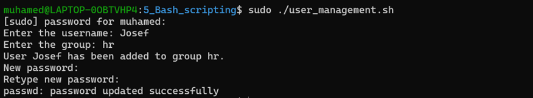
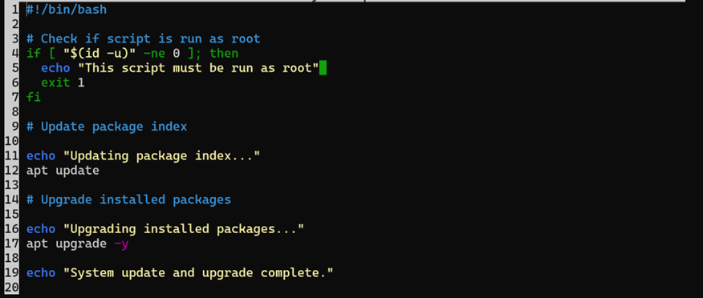

1_User Management Script



## Description

This Bash script automates the process of adding new users to a Linux system. It performs the following tasks:
- Checks if the script is run with root privileges.
- Prompts the user for a new username and group.
- Creates the new user and adds them to the specified group.
- Sets a password for the new user.

This script is useful for Linux administrators who need to manage user accounts 
efficiently.

## Features

- **Root Privilege Check:** Ensures that the script is executed as root, which is
  necessary for user management.
- **User Creation:** Creates a new user and adds them to a specified group.
- **Password Setting:** Allows setting a password for the newly created user.

## Usage

1. **Make the Script Executable**

   Before running the script, ensure it has execute permissions:

   ```bash
   chmod +x user_management.sh

The script will prompt you to enter the username and group for the new user.
Afterward, it will ask you to set a password for the new user you see in 
the screenshot:



2_System Update Script



Objective:
Automate the process of updating and upgrading system packages on a Linux-based machine to ensure the system is running the latest software versions and security patches.

Script: system_update.sh
Description:
The system_update.sh script is designed to automate the process of updating the package index and upgrading installed packages on a Debian-based Linux system. This script simplifies system maintenance by ensuring that all software is up-to-date with the latest versions and patches.

How It Works:
Root Privileges Check: The script first verifies if it is being run with root privileges. This is essential because system updates require administrative access. If the script is not run as root, it exits with a message indicating that root access is required.

Updating Package Index: The apt update command is used to refresh the list of available packages and their versions. This ensures that the system has the most current information about available updates.

Upgrading Packages: The apt upgrade -y command upgrades all installed packages to their latest versions. The -y flag automatically confirms the upgrade, so no additional user input is needed.

Completion Message: After completing the update and upgrade process, the script prints a message indicating that the system update and upgrade are complete.

Usage:
Save the script as system_update.sh.

Make the script executable:

chmod +x system_update.sh

screenshott

3_Log File Cleanup Script

Objective:
Automate the cleanup of old log files to free up disk space and maintain an efficient logging system.
Script: log_cleanup.sh
Description:
The log_cleanup.sh script is designed to find and delete log files older than a specified number of days in a given directory. This helps in managing disk space by removing outdated log files, ensuring that the system’s storage is used efficiently.

xx  screen foor script

How It Works:
1.Log Directory: The script specifies the directory where log files are stored. By default, this is set to /var/log, but it can be changed to any directory containing log files.
2.Retention Period: The script sets a retention period for the log files. In this example, it keeps log files for 30 days. Files older than this period will be deleted.
3.Find and Delete: The find command is used to locate log files (*.log) in the specified directory that are older than the specified number of days. The -exec rm -f {} part of the command deletes these files.
4.Cleanup Message: The script outputs messages indicating the start and completion of the log file cleanup process.

Usage:
1.Save the script as log_cleanup.sh.
2.Make the script executable:
chmod +x log_cleanup.sh
3Run the script with root privileges
sudo ./log_cleanup.sh

xscreen for the output

